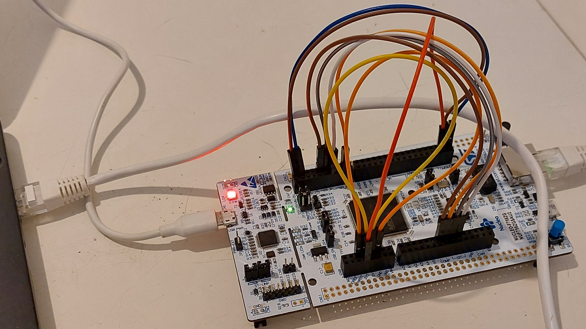
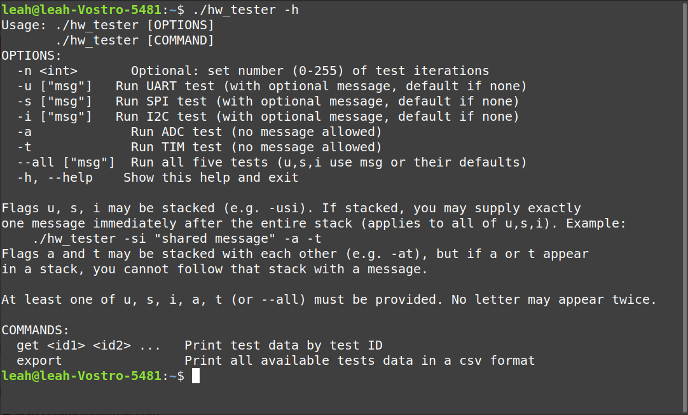
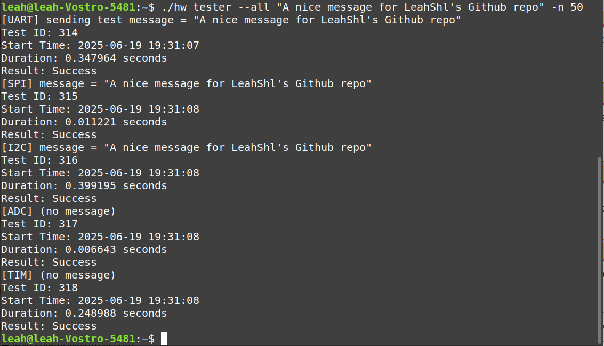
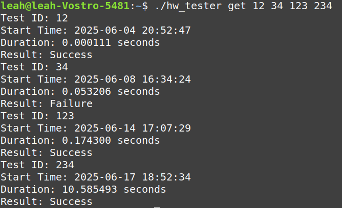
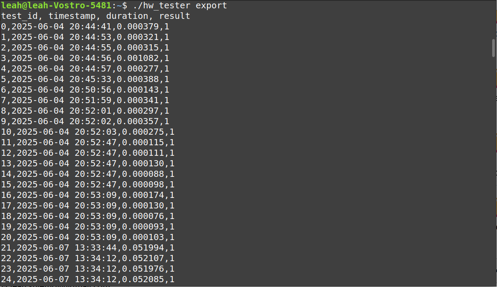

# Photo Gallery
## Hardware Setup
Board is connected directly to PC via ethernet, and via USB through the ST-Link port. GPIO pins are connected as explained [here](https://github.com/LeahShl/STM32F756ZG_HW_Verification/blob/main/README.md#4-setup-hardware). 

## CLI Output examples
### Printing help menu using `-h`/`--help`

### Running tests using `--all`

### Printing specific test info using `get`

There is some behind-the-scenes info about the tests:
 - Test 12 was done before I wrote the STM32 code, so I had to use a dummy server to test the PC code. The dummy server always gives success responses. Notice the fast response time too.
 - Test 23 was done during the development proccess and it failed due to some non-hardware reason.
 - Test 123 was done during the development process. While successful, it was slowed down by debugging prints.
 - Test 234 was done during active debugging with the debugger. Notice the long response time due to stopping at breakpoints.

### Exporting database in CSV format using `export`
Only the top rows are shown. Output can be redirected to a file, i.e. `./hw_tester export > test_results.csv`.

